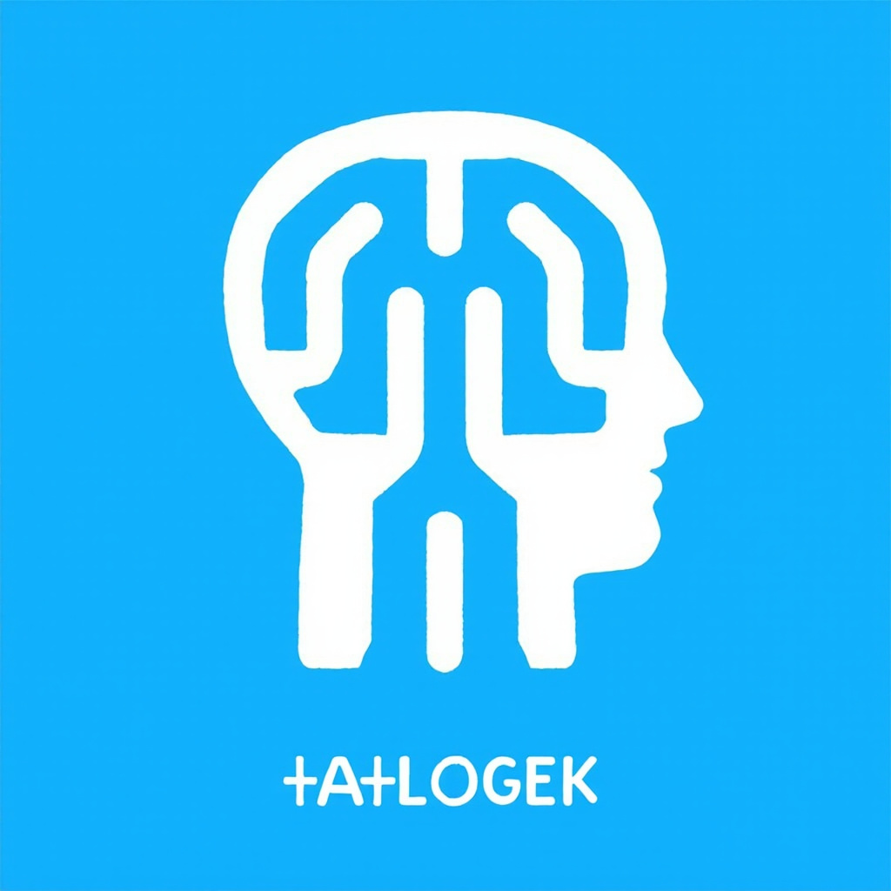
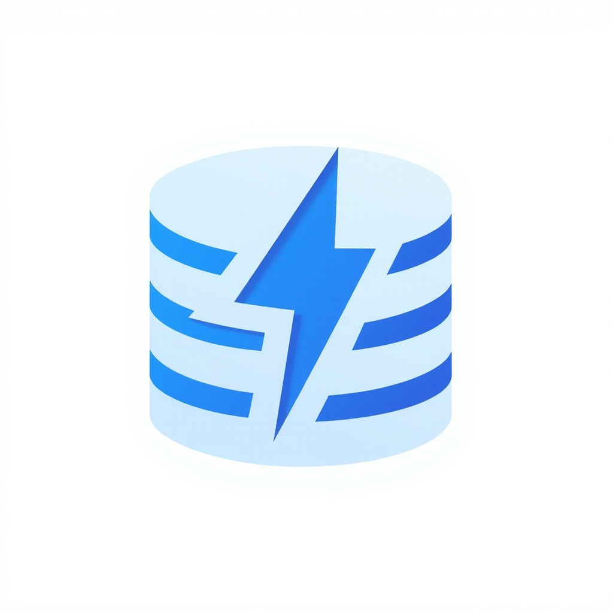

# 🤖 OfficeBot

<p align="center">
  
</p>

> **Desktop AI Agent** — Multi-plataforma, multilíngue, extensible

[](https://opensource.org/licenses/MIT)
[](https://www.electronjs.org/)
[](https://react.dev/)
[](https://www.typescriptlang.org/)
[](https://nodejs.org/)

---

## 🎯 O que é o OfficeBot?

**OfficeBot** é um agente de IA desktop de próxima geração, projetado para automação de trabalho e produtividade. Permite conversar com múltiplos provedores de IA (Gemini, Claude, OpenAI, Anthropic, etc.), gerenciar equipes de agentes, integrar canais de mensageria (Telegram, WhatsApp, DingTalk, Lark, WeCom) e estender funcionalidades via plugins.

**Destaque:** Locale padrão em **Português (pt-BR)** com suporte a múltiplos idiomas.

---

## ✨ Funcionalidades Principais

### 🤖 Agentes Inteligentes


- **6+ engines de IA** integradas: Gemini, Claude (Codex), AionRS, OpenClaw Gateway, Nanobot, Agentes Remote
- **ACP Protocol** — JSON-RPC com FSM de 7 estados para sessões robustas
- **Agent Registry** com detecção automática de CLI e deduplicação inteligente
- **Permission Cache** LRU com 500 entradas para respostas instantâneas

### 💬 Canais de Mensageria


| Plataforma | Status | Features |
|---|---|---|
| Telegram | ✅ Estável | Webhooks, streaming, pairing |
| Lark (Feishu) | ✅ Estável | OAuth, degradação automática |
| DingTalk | ✅ Estável | AI Card → Webhook → Open API |
| WeChat | ✅ Estável | Work integration |
| WeCom | ✅ Estável | Enterprise WeChat, signature verification |

- **Pairing codes** 6 dígitos com TTL de 10min
- **Throttle** 500ms para streaming otimizado
- **Deduplicação** de eventos com cache 5min

### 👥 Team Mode


- Colaboração multi-agente com líder e teammates
- **Mailbox** para mensagens assíncronas
- **Task Manager** com dependências (blockedBy)
- **MCP Server** integrado para ferramentas externas
- Workspace modes: `shared` ou `isolated`

### 🧩 Sistema de Extensões


- **Sandbox** isolado com Worker Threads
- **Hub** marketplace para descoberta
- **Hot reload** para desenvolvimento
- Permissões declarativas com validação Zod
- Lifecycle completo: install → activate → deactivate → uninstall

### 🗄️ Database


- **SQLite** com WAL mode para concorrência
- **13 tabelas** com repositories especializados
- **StreamingMessageBuffer** (flush 300ms/20 chunks)
- **Migration system** com rollback automático
- **Corruption recovery** com backup automático

### 🌐 Webserver

- Express + WebSocket standalone
- JWT auth com rotation
- Rate limiting configurável (60/min, 30/min, 20/min)
- CSRF protection
- bcrypt constant-time

### 🎨 UI (Renderer)


- React 18 com hooks customizados
- **21 telas** em modo literal
- Default pt-BR com fallback en-US
- Deep link: `officebot://`
- Cookie: `officebot-session`

---

## 🏗️ Arquitetura

```
OfficeBot/
├── src/
│   ├── common/           # Compartilhado (i18n, security, types, utils)
│   ├── preload/          # Electron preload scripts
│   ├── process/          # Main process (Node.js)
│   │   ├── acp/          # ACP Protocol (FSM 7 estados)
│   │   ├── agent/        # Agent Registry (6+ engines)
│   │   ├── bridge/       # IPC Bridge (44+ bridges)
│   │   ├── channels/     # 5 plataformas de mensageria
│   │   ├── extensions/   # Sistema de extensões + Hub
│   │   ├── services/
│   │   │   └── database/ # SQLite + repositories
│   │   ├── team/         # Team mode (mailbox, tasks, MCP)
│   │   ├── webserver/    # Express + WebSocket
│   │   └── worker/       # Fork workers
│   └── renderer/         # UI React
│       ├── pages/        # 6 páginas principais
│       ├── components/   # Componentes reutilizáveis
│       └── hooks/        # Hooks customizados
├── mobile/               # Expo/React Native (futuro)
├── scripts/              # Scripts de automação
└── tests/                # Parity tests (Gherkin)
```

### Paradigma

**Híbrido OO + DI + Event-driven**

- **OO com DI:** Repository Pattern, Bridge Pattern, Host Pattern
- **Event-driven:** 14 FSMs, EventEmitter para pub/sub, IPC com providers e emitters

---

## 🎨 Assets

<p align="center">
  
</p>

| Asset | Descrição |
|---|---|
| [`assets/logo.png`](assets/logo.png) | Logo do app (1024x1024) |
| [`assets/banner.png`](assets/banner.png) | Banner para redes sociais (1920x1080) |
| [`assets/hero.png`](assets/hero.png) | Ilustração hero do produto |
| [`assets/icon-agent.png`](assets/icon-agent.png) | Ícone: Agentes AI |
| [`assets/icon-channels.png`](assets/icon-channels.png) | Ícone: Canais de mensageria |
| [`assets/icon-team.png`](assets/icon-team.png) | Ícone: Colaboração em equipe |
| [`assets/icon-extensions.png`](assets/icon-extensions.png) | Ícone: Sistema de extensões |
| [`assets/icon-database.png`](assets/icon-database.png) | Ícone: Banco de dados |
| [`assets/icon-security.png`](assets/icon-security.png) | Ícone: Segurança |

---

## 🛠️ Tech Stack

| Camada | Tecnologia |
|---|---|
| Runtime | Node.js 20+ |
| Desktop | Electron 2.0+ |
| UI | React 18 |
| Linguagem | TypeScript 5 |
| Database | SQLite (better-sqlite3) |
| HTTP | Express + WebSocket |
| Auth | JWT + bcrypt |
| Validation | Zod |
| Testing | Gherkin (Cucumber) |

---

## 🚀 Instalação

### Pré-requisitos

- Node.js 20+
- npm 9+ ou pnpm 8+
- Git

### Clone e Setup

```bash
# Clone o repositório
git clone https://github.com/ricardopera/OfficeBot.git
cd OfficeBot

# Instale dependências
npm install

# Build de produção
npm run build

# Ou execute em modo desenvolvimento
npm run dev
```

### Configuração de Ambiente

```bash
# Copie o template de ambiente
cp .env.example .env

# Edite com suas configurações
# OFFICEBOT_SECRET=your-secret-key
# OFFICEBOT_PORT=3000
# OFFICEBOT_LOCALE=pt-BR
```

---

## 📖 Uso

### Iniciar o App

```bash
npm run start
```

### Comandos Disponíveis

| Comando | Descrição |
|---|---|
| `npm run dev` | Modo desenvolvimento com HMR |
| `npm run build` | Build de produção (Electron + WebUI) |
| `npm run start` | Iniciar aplicação |
| `npm run test` | Executar suite de testes |
| `npm run test:e2e` | Executar parity tests |
| `npm run lint` | Verificar código |
| `npm run typecheck` | Verificar tipos TypeScript |

### Deep Links

```bash
# Abrir conversa
officebot://chat?conversationId=xxx

# Abrir configurações
officebot://settings?tab=general

# Criar novo agente
officebot://agent/new?backend=gemini
```

---

## 🧪 Testes

### Parity Tests (Gherkin)

54 cenários em 10 arquivos `.feature`:

```bash
# Executar todos os parity tests
npm run test:e2e

# Executar cenário específico
npm run test:e2e -- --tags @critico
```

### Cobertura

| Fluxo | Critério |
|---|---|
| ACP Session | ✅ @critico |
| Conversation + Messaging | ✅ @critico |
| Agent Registry | ✅ @critico |
| Channel Streaming | ✅ @critico |
| Team Collaboration | ✅ |
| Extension Lifecycle | ✅ |
| Webserver Auth | ✅ @critico |
| Database Persistence | ✅ @critico |
| IPC Bridge | ✅ @critico |
| Data Migration v27 | ✅ @critico |

---

## 🔧 Configuração

### Idiomas

| Locale | Status | Description |
|---|---|---|
| `pt-BR` | ✅ Default | Português brasileiro |
| `en-US` | ✅ Fallback | English (US) |
| `zh-CN` | ✅ Disponível | Chinese simplified |

### Agentes

```typescript
// Configuração de agentes em src/process/agent/
const agents = {
  gemini: { alwaysOn: true, cliCheck: false },
  aionrs: { alwaysOn: true, cliCheck: false },
  acp: { builtin: true },
  openclawGateway: { url: 'https://...' },
  // ...
}
```

### Canais

```json
{
  "channels": {
    "telegram": { "botToken": "xxx" },
    "lark": { "appId": "xxx", "appSecret": "xxx" },
    "dingtalk": { "appKey": "xxx", "appSecret": "xxx" },
    "wechat": { "workId": "xxx" },
    "wecom": { "corpId": "xxx", "agentId": "xxx" }
  }
}
```

---

## 📦 Extensões

### Instalar Extensão

```bash
# Via Hub
officebot extension install nome-da-extensao

# Via arquivo local
officebot extension install ./minha-extensao-1.0.0.tgz
```

### Manifest (officebot-extension.json)

```json
{
  "name": "minha-extensao",
  "version": "1.0.0",
  "permissions": ["filesystem", "network"],
  "contributes": {
    "commands": [{ "name": "hello", "handler": "./dist/handler.js" }]
  }
}
```

---

## 🤝 Contributing

1. Fork o repositório
2. Crie uma branch (`git checkout -b feature/nova-funcionalidade`)
3. Commit suas mudanças (`git commit -m 'feat: nova funcionalidade'`)
4. Push para a branch (`git push origin feature/nova-funcionalidade`)
5. Abra um Pull Request

---

## 📄 Licença

MIT License — [LICENSE](LICENSE)

---

## 🗺️ Roadmap

| Fase | Descrição | Status |
|---|---|---|
| v1.0.0-rc1 | Reconstrução do zero via Reversa | ✅ Concluído |
| v1.0.0 | Release estável | 🚧 Em progresso |
| v1.1.0 | Mobile app (Expo/React Native) | 📅 Planejado |
| v1.2.0 | Plugin marketplace público | 📅 Planejado |

---

<p align="center">
  <strong>OfficeBot</strong> — Construído com 💚 usando Reversa + TypeScript + Electron + React
  <br>
  <sub>https://github.com/ricardopera/OfficeBot</sub>
</p>